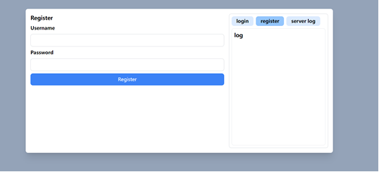
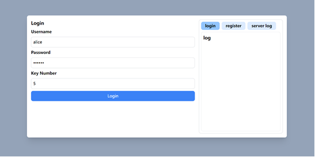
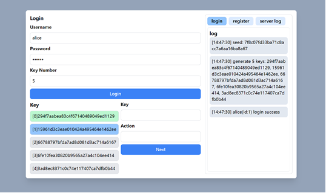
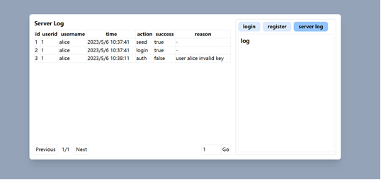

# Qwik S/Key

这是一个简单的 S/Key 实现，使用 Qwik City。

## 运行

```bash
yarn install
yarn start # or yarn dev
```

## 预览









## 原理

1. 用户输入用户名与密码。客户端对输入的密码使用 md5 进行加密。
2. 客户端发送用户名到服务端获取 seed，服务端获得用户名后检查用户是否存在，不存在则返回错误，存在则生成一个随机
   seed，取出数据库中的存储的使用 md5 加密后的用户密码，与 seed 拼接后使用 md5 再次加密并存储，返回生成的 seed。
3. 客户端获得 seed 后，使用加密后的密码与 seed 进行一次安全散列，之后进行 N 次 md5 散列生成 N 个密码，反转顺序后返回。在客户端使用密码和
   seed 拼接后进行一次 md5 当成密码，和用户名以及第 1 个生成的 Key 发送给服务端请求登录。
4. 服务端获取到用户名和密码，与获取 seed 时保存的密码相比较，若相同，则将发送来的 Key 保存在数据库中，返回登录成功的结果。否则返回登录失败。
5. 接下来，用户可以使用第 2 个生成的 key 对服务端发起 action 请求，请求中包含用户 id，key 和发起的 action。
6. 服务端接受到 action 请求后，查找用户 id 是否存在存储的 key，若没有则返回用户未登录。若存在则将发送来的 key 进行一次 md5
   散列，若散列后结果与存储的 key 相同，则认证成功，服务端更新保存的 key 为请求中包含的 key，客户端成功发起请求。若不同则认证失败。
7. 接下来客户端可以使用第 3 个 Key 进行请求，以此类推直到生成的 Key 被用完。
8. 当使用到第 N-1 个 Key 时，客户端会重新生成 N 个新的 Key，自动使用第原来的 N 个 Key 对服务端发起刷新请求，同时传递新生成的第一个
   Key。服务端验证原来的 Key 成功后会使用保存新生成的第一个 Key，完成刷新。客户可以从新生成的 Key 的第二个开始继续使用。
9. 服务端会保存所有客户端进行的操作，包括操作的用户，操作时间，动作，成功与否，失败原因。
